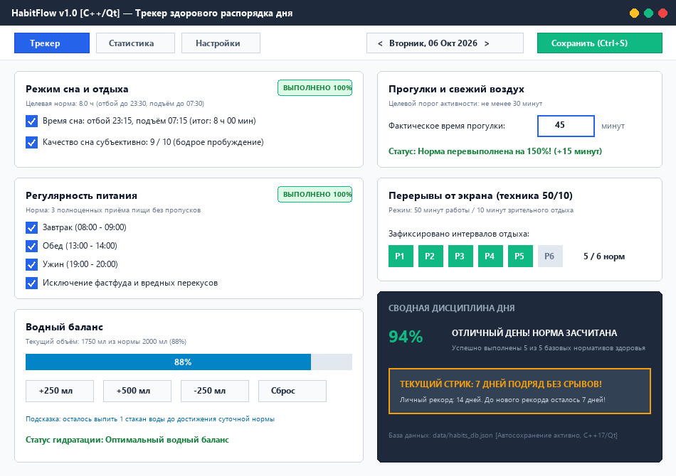
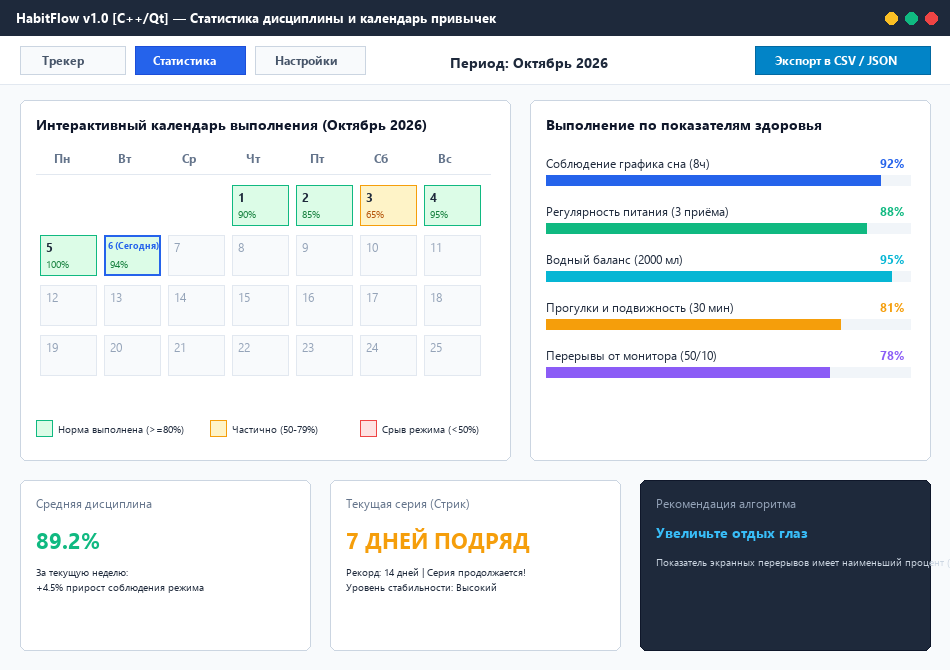
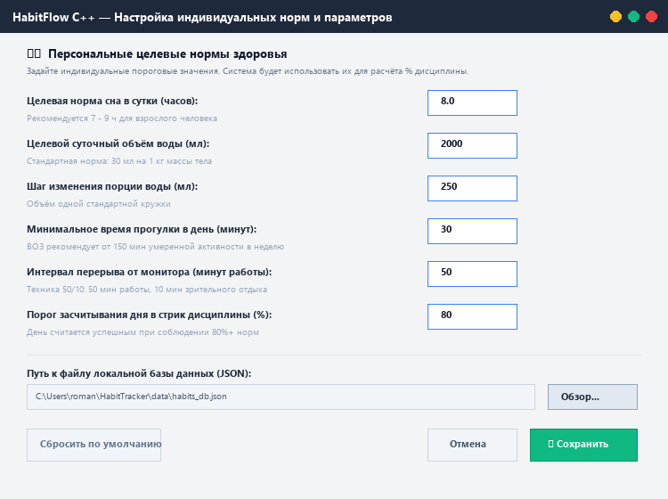
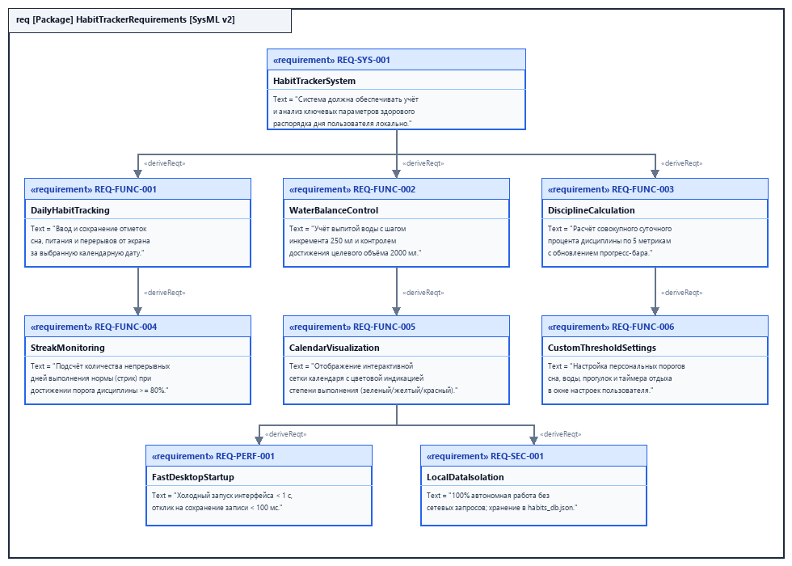

# Спецификация требований к ПО

Для проекта «Трекер здорового распорядка дня и полезных привычек» (HabitFlow C++)

Версия 0.2

Подготовил Петкун Роман Юрьевич

БГУИР

06.10.2026

---

## Оглавление

<!-- TOC -->
* [История изменений](#история-изменений)
* [1. Введение](#1-введение)
  * [1.1 Назначение документа](#11-назначение-документа)
  * [1.2 Область применения продукта](#12-область-применения-продукта)
  * [1.3 Определения, акронимы и сокращения](#13-определения-акронимы-и-сокращения)
  * [1.4 Ссылки](#14-ссылки)
  * [1.5 Обзор документа](#15-обзор-документа)
* [2. Обзор продукта](#2-обзор-продукта)
  * [2.1 Перспектива продукта](#21-перспектива-продукта)
  * [2.2 Функции продукта](#22-функции-продукта)
  * [2.3 Ограничения продукта](#23-ограничения-продукта)
  * [2.4 Характеристики пользователей](#24-характеристики-пользователей)
  * [2.5 Допущения и зависимости](#25-допущения-и-зависимости)
  * [2.6 Распределение требований](#26-распределение-требований)
* [3. Требования](#3-требования)
  * [3.1 Внешние интерфейсы](#31-внешние-интерфейсы)
    * [3.1.1 Пользовательские интерфейсы](#311-пользовательские-интерфейсы)
    * [3.1.2 Аппаратные интерфейсы](#312-аппаратные-интерфейсы)
    * [3.1.3 Программные интерфейсы](#313-программные-интерфейсы)
  * [3.2 Функциональные требования](#32-функциональные-требования)
  * [3.3 Качество обслуживания](#33-качество-обслуживания)
    * [3.3.1 Производительность](#331-производительность)
    * [3.3.2 Безопасность](#332-безопасность)
    * [3.3.3 Надёжность](#333-надёжность)
    * [3.3.4 Доступность](#334-доступность)
    * [3.3.5 Наблюдаемость](#335-наблюдаемость)
  * [3.4 Соответствие стандартам](#34-соответствие-стандартам)
  * [3.5 Проектирование и реализация](#35-проектирование-и-реализация)
    * [3.5.1 Установка](#351-установка)
    * [3.5.2 Сборка и поставка](#352-сборка-и-поставка)
    * [3.5.3 Распределение](#353-распределение)
    * [3.5.4 Сопровождаемость](#354-сопровождаемость)
    * [3.5.5 Повторное использование](#355-повторное-использование)
    * [3.5.6 Переносимость](#356-переносимость)
    * [3.5.7 Стоимость](#357-стоимость)
    * [3.5.8 Сроки](#358-сроки)
    * [3.5.9 Доказательство концепции](#359-доказательство-концепции)
    * [3.5.10 Управление изменениями](#3510-управление-изменениями)
  * [3.6 ИИ/МО](#36-иимо)
* [4. Верификация](#4-верификация)
* [5. Приложения](#5-приложения)
<!-- TOC -->

---

## История изменений

| Name | Date | Reason For Changes | Version |
| :--- | :--- | :--- | :--- |
| HabitFlow C++ | 06.10.2026 | Начальная версия спецификации требований (драфт по результатам интервью с Заказчиком) | 0.1 |
| HabitFlow C++ | 06.10.2026 | Внесение правок по замечаниям Заказчика из Pull Request: добавление настраиваемого таймера перерывов, виджета стрика и экспорта в CSV | 0.2 |

---

## 1. Введение {#1-введение}

Настоящий документ представляет собой спецификацию требований к программному обеспечению (Software Requirements Specification, SRS) для десктопного приложения «Трекер здорового распорядка дня и полезных привычек» (HabitFlow C++). Документ определяет функциональные, эксплуатационные и качественные требования к системе на этапах проектирования, разработки, тестирования и сдачи в рамках дисциплины «Жизненный цикл разработки программного обеспечения».

### 1.1 Назначение документа {#11-назначение-документа}

Настоящий документ предназначен для формализации соглашения между Заказчиком и Разработчиком (студентом группы 450503 Петкуном Р.Ю.).

**Заказчик проекта:** Равковский Андрей Владимирович (студент группы 450503).

Спецификация определяет исчерпывающий перечень того, **ЧТО** система должна делать, критерии приемлемости и методы верификации. Документ служит единым источником правды для проектирования архитектуры (SDD), реализации на языке C++ с использованием библиотеки графического интерфейса Qt и приёмо-сдаточных испытаний.

### 1.2 Область применения продукта {#12-область-применения-продукта}

Продукт **HabitFlow C++ (версия 1.0)** — автономное десктопное приложение для контроля персонального распорядка дня. Система ориентирована на людей умственного труда и студентов инженерных специальностей, проводящих за компьютером более 6 часов в день.

**Входит в рамки проекта (In-Scope):**
- Ежедневный учёт 5 ключевых показателей: график сна, регулярность питания, объём выпитой воды, время прогулок на свежем воздухе и перерывы от экрана.
- Расчёт интегрального суточного процента дисциплины.
- Подсчёт непрерывной серии выполнения нормативов (стриков) при достижении порога >= 80%.
- Интерактивный календарь с цветовой индикацией уровня дисциплины за месяц и неделю.
- Настройка индивидуальных целевых норм (пороги воды, сна, времени прогулки, интервала отдыха).
- Полная автономия: локальное хранение данных в формате JSON с возможностью экспорта в CSV.

**НЕ входит в рамки проекта (Out-of-Scope):**
- Создание мобильных версий под Android/iOS.
- Облачная синхронизация данных и многопользовательский веб-сервер.
- Прямая аппаратная интеграция со сторонними фитнес-трекерами и умными часами.
- Глубокий медицинский расчёт калорийности и нутриентов (КБЖУ).

### 1.3 Определения, акронимы и сокращения {#13-определения-акронимы-и-сокращения}

| Term | Definition |
| :--- | :--- |
| **API** | Application Programming Interface — программный интерфейс взаимодействия компонентов. |
| **GUI** | Graphical User Interface — графический пользовательский интерфейс приложения. |
| **QoS** | Quality of Service — атрибуты качества обслуживания (производительность, надёжность и др.). |
| **SRS** | Software Requirements Specification — спецификация требований к программному обеспечению. |
| **SysML v2** | Systems Modeling Language v2 — язык системного моделирования следующего поколения (OMG). |
| **UI** | User Interface — визуальная часть приложения, через которую пользователь взаимодействует с ПО. |
| **Стрик (Streak)** | Непрерывная последовательность календарных дней, в течение которых норматив дисциплины выполнен успешно. |

### 1.4 Ссылки {#14-ссылки}

1. **ISO/IEC/IEEE 29148:2018** — Systems and software engineering — Life cycle processes — Requirements engineering. (Нормативный стандарт).
2. **IEEE Std 830-1998** — IEEE Recommended Practice for Software Requirements Specifications. (Справочный стандарт).
3. **ISO/IEC 25010:2011** — Systems and software engineering — Systems and software Quality Requirements and Evaluation (SQuaRE). (Справочный стандарт).
4. **OMG Systems Modeling Language (SysML) Version 2.0 Specification** — Object Management Group, 2023. (Нормативный стандарт).
5. **СТП 01-2017** — Стандарт предприятия. Дипломные проекты (работы), курсовые проекты (работы), лабораторные работы. Требования и порядок оформления. БГУИР, Минск. (Нормативный стандарт).

### 1.5 Обзор документа {#15-обзор-документа}

Документ состоит из 5 разделов:
- **Раздел 1:** Введение, границы системы и терминологический аппарат.
- **Раздел 2:** Высокоуровневый обзор продукта, характеристики пользователей и архитектурные ограничения.
- **Раздел 3:** Детализированные требования к внешним интерфейсам, функциональности (с уникальными идентификаторами `REQ-FUNC-xxx`), качеству обслуживания (QoS) и реализации.
- **Раздел 4:** Матрица трассируемости и верификации требований.
- **Раздел 5:** Приложения со схемами данных, прототипами GUI и моделями SysML v2.

---

## 2. Обзор продукта {#2-обзор-продукта}

### 2.1 Перспектива продукта {#21-перспектива-продукта}

Продукт является независимым автономным десктопным приложением. Он призван устранить недостатки существующих коммерческих решений (навязчивая реклама, требования платной подписки, обязательная сетевая регистрация, избыточная сложность). Продукт функционирует полностью на стороне клиента под управлением ОС семейств Windows и Linux, сохраняя данные в локальный файл `habits_db.json`.

### 2.2 Функции продукта {#22-функции-продукта}

1. **Ежедневный учёт привычек:** Быстрая фиксация параметров сна, приёмов пищи, воды, прогулок и перерывов.
2. **Инкрементный ввод воды:** Добавление выпитой жидкости кнопками быстрого набора (+250 мл, +500 мл) со шкалой прогресса.
3. **Расчёт дисциплины дня:** Математический расчёт совокупного процента соблюдения режима с цветовой дифференциацией.
4. **Учёт серий (стрик-трекер):** Определение стабильности здорового образа жизни по количеству непрерывных дней успеха.
5. **Аналитический календарь:** Наглядное представление дисциплины за месяц с разбивкой по отдельным привычкам.
6. **Конфигурация норм:** Гибкая настройка целевых показателей под индивидуальные физиологические потребности пользователя.
7. **Экспорт данных:** Возможность выгрузки истории наблюдений в формат CSV для последующего анализа в Excel.

### 2.3 Ограничения продукта {#23-ограничения-продукта}

- **Язык разработки:** Стандарт C++17 (ISO/IEC 14882:2017).
- **Графическая библиотека:** Qt 6 (модуль Qt Widgets) для кроссплатформенного десктопного GUI.
- **Интерфейс:** Desktop GUI с адаптивной вёрсткой для разрешения не менее 1280x720 пикселей.
- **Локальность:** 100% автономия, запрет любых внешних сетевых соединений.
- **Формат персистентности:** Локальный файл JSON (структурированный, валидируемый по схеме).
- **Среда сборки:** Кроссплатформенная сборочная система CMake (версия 3.16+).

### 2.4 Характеристики пользователей {#24-характеристики-пользователей}

Основная целевая аудитория — студенты, IT-специалисты и инженеры, проводящие длительное время за экраном монитора. Пользователи обладают базовой компьютерной грамотностью, ценят скорость ввода (не более 1 минуты в день), приватность личной информации и отсутствие отвлекающих факторов.

### 2.5 Допущения и зависимости {#25-допущения-и-зависимости}

- Предполагается наличие прав на запись в каталог исполняемого файла либо в стандартную директорию пользователя (`AppData` / `~/.config`).
- Предполагается корректно настроенное системное время операционной системы для определения текущей даты.
- Внешние библиотеки: стандартная библиотека C++ STL, библиотека Qt 6 (Widgets, Core, Gui), библиотека сериализации JSON.

### 2.6 Распределение требований {#26-распределение-требований}

- **Итерация 1 (Базовый каркас):** Архитектура ядра C++, модуль ввода 5 показателей, локальное сохранение в JSON (`REQ-FUNC-001` .. `REQ-FUNC-004`).
- **Итерация 2 (Аналитика и стрики):** Интерактивный календарь, алгоритм подсчёта серий непрерывности (`REQ-FUNC-005`, `REQ-FUNC-006`).
- **Итерация 3 (Настройки и экспорт):** Диалог параметров, экспорт в CSV, виджет стрика (`REQ-FUNC-007` .. `REQ-FUNC-010`).

---

## 3. Требования {#3-требования}

### 3.1 Внешние интерфейсы {#31-внешние-интерфейсы}

#### 3.1.1 Пользовательские интерфейсы {#311-пользовательские-интерфейсы}

Пользовательский интерфейс десктопного приложения на C++/Qt состоит из трех основных экранов/панелей, спроектированных в соответствии с нотацией **SysML v2** (см. исходный код в файле [sysml/gui_prototype.sysml](sysml/gui_prototype.sysml)):

1. **Главный экран трекера (Tracker View):**
   - Навигационная шапка с текущей датой и кнопками листания дней.
   - Карточки контроля: «Режим сна», «Регулярность питания», «Водный баланс», «Прогулки и активность», «Перерывы от монитора».
   - Информационная плашка суточной дисциплины (%) и индикатор текущего стрика.
   - Графический мокап: [mockup_main_window.png](img/mockup_main_window.png).



2. **Экран аналитики и календаря (Statistics View):**
   - Месячная календарная сетка с цветовой дифференциацией дней (зеленый / желтый / красный).
   - Горизонтальные шкалы соблюдения отдельных категорий привычек.
   - Сводные показатели средней дисциплины и рекордного стрика.
   - Графический мокап: [mockup_statistics_calendar.png](img/mockup_statistics_calendar.png).



3. **Окно настройки целевых норм (Settings View):**
   - Поля редактирования порогов (сон, вода, шаг инкремента, прогулки, интервал перерывов).
   - Выбор расположения файла локальной базы данных.
   - Графический мокап: [mockup_settings.png](img/mockup_settings.png).



4. **Дерево требований в нотации SysML v2:**
   - Графическая диаграмма декомпозиции и связей требований: [sysml_requirements_diagram.png](img/sysml_requirements_diagram.png).



#### 3.1.2 Аппаратные интерфейсы {#312-аппаратные-интерфейсы}

- Стандартная клавиатура и манипулятор «мышь».
- Поддержка горячих клавиш: `Ctrl+S` — быстрое сохранение данных за день, `Ctrl+1` / `Ctrl+2` / `Ctrl+3` — переключение вкладок Qt.
- Минимальное разрешение дисплея: 1280x720 пикселей.

#### 3.1.3 Программные интерфейсы {#313-программные-интерфейсы}

- Локальная файловая система операционной системы (POSIX / Win32 API).
- Библиотека пользовательского интерфейса Qt 6 Widgets.
- Формат обмена и персистентности: кодировка UTF-8, формат JSON (RFC 8259).

---

### 3.2 Функциональные требования {#32-функциональные-требования}

#### REQ-FUNC-001: Ежедневный учёт базовых показателей сна и питания
- **ID:** `REQ-FUNC-001-01`
- **Title:** Ввод параметров сна и чек-лист приёмов пищи
- **Statement:** Система должна позволять пользователю выбирать произвольную календарную дату и отмечать соблюдение графика сна (время отбоя и пробуждения с контролем достижения нормы в часах) и чек-лист приёмов пищи (завтрак, обед, ужин).
- **Rationale:** Регулярный сон и своевременное питание являются фундаментальной основой профилактики переутомления при работе за ПК.
- **Acceptance Criteria:**
  - При выборе даты загружаются ранее сохранённые данные за этот день (или значения по умолчанию).
  - При установке отметок всех трёх приёмов пищи показатель питания считается выполненным на 100%.
  - Фактическая длительность сна рассчитывается автоматически по времени отбоя и подъёма.
- **Verification Method:** Demonstration.
- **More Information:** Связано с Use Case UC-1.

#### REQ-FUNC-002: Контроль водного баланса с инкрементным вводом
- **ID:** `REQ-FUNC-002-01`
- **Title:** Учёт выпитой воды порциями со шкалой прогресса
- **Statement:** Система должна предоставлять интерфейс быстрого инкремента выпитой воды кнопками `+250 мл` и `+500 мл`, отображать текущий суммарный объём относительно целевой нормы и обновлять графическую шкалу прогресса.
- **Rationale:** Поддержание гидратации критично для концентрации внимания, а пошаговый ввод исключает необходимость ручного набора цифр.
- **Acceptance Criteria:**
  - Нажатие кнопки `+250 мл` увеличивает суточный показатель ровно на 250 мл.
  - Шкала прогресса корректно отражает процент выполнения (например, 1750 / 2000 мл = 88%).
  - Предусмотрена возможность ручного сброса или ввода произвольного значения.
- **Verification Method:** Test.
- **More Information:** SysML requirement `WaterBalanceControl`.

#### REQ-FUNC-003: Учёт прогулок и интервалов отдыха от монитора
- **ID:** `REQ-FUNC-003-02`
- **Title:** Контроль физической активности и зрительного отдыха
- **Statement:** Система должна учитывать длительность прогулок на свежем воздухе в минутах (цель >= 30 мин) и количество соблюдённых перерывов от экрана. По запросу Заказчика (v0.2) интервал работы до перерыва должен быть настраиваемым в окне параметров.
- **Rationale:** Борьба с гиподинамией и зрительным переутомлением у программистов.
- **Acceptance Criteria:**
  - Ввод 30+ минут активности переводит статус прогулки в состояние «Выполнено».
  - Зафиксированные интервалы отдыха визуализируются слотами P1..Pn.
- **Verification Method:** Demonstration.
- **More Information:** Обновлено по результатам рецензии Заказчика в PR.

#### REQ-FUNC-004: Автоматический расчёт суточного процента дисциплины
- **ID:** `REQ-FUNC-004-01`
- **Title:** Вычисление интегрального показателя дисциплины
- **Statement:** Система должна вычислять интегральный суточный процент дисциплины как средневзвешенную сумму выполнения 5 нормативов: сон (вес 25%), питание (20%), вода (20%), прогулка (20%), перерывы от экрана (15%).
- **Rationale:** Единая числовая метрика мотивирует пользователя придерживаться сбалансированного режима дня.
- **Acceptance Criteria:**
  - При 100% выполнении всех 5 норм результирующий процент равен 100%.
  - Значение дисциплины мгновенно обновляется при сохранении показателей.
- **Verification Method:** Test.
- **More Information:** Формула: сумма взвешенных коэффициентов достижения норм.

#### REQ-FUNC-005: Подсчёт непрерывных серий выполнения (стриков)
- **ID:** `REQ-FUNC-005-01`
- **Title:** Алгоритм вычисления стрика
- **Statement:** Система должна определять количество подряд идущих календарных дней, для каждого из которых суммарный процент дисциплины превысил установленный порог (по умолчанию 80%), и сохранять значение максимального рекорда.
- **Rationale:** Геймификация и серия побед формируют долгосрочную привычку.
- **Acceptance Criteria:**
  - Если за вчерашний день дисциплина >= 80%, а за сегодня норма также выполнена, стрик увеличивается на +1.
  - Если за какой-либо день норма составила < 80%, текущий стрик обнуляется (но рекорд сохраняется).
- **Verification Method:** Test.
- **More Information:** Связано с Use Case UC-2.

#### REQ-FUNC-006: Интерактивный календарь дисциплины
- **ID:** `REQ-FUNC-006-01`
- **Title:** Визуализация календаря с цветовым статусом
- **Statement:** Система должна выводить сетку дней месяца/недели, подсвечивая ячейку каждого дня в зависимости от процента дисциплины: зелёный (норма >= 80%), жёлтый (частично, 50-79%), красный (срыв, < 50%).
- **Rationale:** Наглядная визуализация истории дисциплины позволяет мгновенно оценить прогресс.
- **Acceptance Criteria:**
  - Клик по дате в календаре открывает детальный отчёт за выбранный день.
  - Отображаются агрегированные показатели средней дисциплины за период.
- **Verification Method:** Demonstration.
- **More Information:** SysML requirement `InteractiveCalendar`.

#### REQ-FUNC-007: Настройка индивидуальных целевых норм
- **ID:** `REQ-FUNC-007-01`
- **Title:** Пользовательская конфигурация пороговых значений
- **Statement:** Система должна предоставлять графический интерфейс для изменения параметров: целевая норма сна (часы), целевой объём воды (мл), минимальное время прогулки (мин), интервал перерывов экрана (мин), порог засчитывания стрика (%).
- **Rationale:** Физиологические потребности зависят от индивидуальных параметров человека.
- **Acceptance Criteria:**
  - Сохранённые в настройках пороги немедленно применяются при последующих расчётах процента дисциплины.
  - Валидация диапазонов не допускает ввода отрицательных либо нереалистичных чисел.
- **Verification Method:** Test, Demonstration.
- **More Information:** Связано с Use Case UC-3.

#### REQ-FUNC-008: Персистентность и атомарное сохранение в JSON
- **ID:** `REQ-FUNC-008-01`
- **Title:** Сохранение структуры данных в локальный файл
- **Statement:** Все пользовательские записи и настройки должны сохраняться в файл `habits_db.json`. Запись должна производиться атомарно через создание временного файла во избежание потери данных при сбоях.
- **Rationale:** Локальное хранение гарантирует сохранность данных и отсутствие утечек во внешнюю сеть.
- **Acceptance Criteria:**
  - При перезапуске приложения все внесённые ранее данные корректно восстанавливаются.
  - Файл имеет валидный формат JSON и кодировку UTF-8.
- **Verification Method:** Test, Inspection.
- **More Information:** Схема JSON представлена в Приложении А.

#### REQ-FUNC-009: Экспорт истории в формат CSV
- **ID:** `REQ-FUNC-009-02`
- **Title:** Экспорт накопленной статистики для внешнего анализа
- **Statement:** По требованию Заказчика (версия 0.2), система должна обеспечивать выгрузку полной истории дней в текстовый файл с разделителями-запятыми (CSV) с колонками: дата, сон, питание, вода, прогулка, перерывы, итоговый процент дисциплины.
- **Rationale:** Позволяет пользователю строить произвольные отчёты в Excel/Google Таблицах.
- **Acceptance Criteria:**
  - Нажатие кнопки «Экспорт в CSV» формирует файл, корректно открываемый в табличных процессорах.
- **Verification Method:** Demonstration, Test.
- **More Information:** Добавлено на основе комментария Заказчика в PR.

#### REQ-FUNC-010: Виджет текущего стрика и мотивации на главном экране
- **ID:** `REQ-FUNC-010-02`
- **Title:** Крупный баннер непрерывной серии на основном экране
- **Statement:** По требованию Заказчика (версия 0.2), на главном экране трекера должен постоянно отображаться акцентный блок «Текущий стрик: N дней подряд» с указанием оставшихся дней до побития личного рекорда.
- **Rationale:** Повышает психологическую вовлечённость пользователя каждый раз при запуске программы.
- **Acceptance Criteria:**
  - Виджет динамически обновляется сразу при заполнении дня и сохранении отметки.
- **Verification Method:** Demonstration.
- **More Information:** Добавлено на основе комментария Заказчика в PR.

---

### 3.3 Качество обслуживания {#33-качество-обслуживания}

#### 3.3.1 Производительность {#331-производительность}

- **REQ-PERF-001:** Время холодного старта приложения до полной готовности интерфейса к взаимодействию не должно превышать 1.0 секунды на процессорах класса Intel Core i3 / AMD Ryzen 3 и выше.
- **REQ-PERF-002:** Заполнение ежедневного чек-листа пользователем при типовом сценарии использования должно занимать не более 60 секунд.
- **REQ-PERF-003:** Время отклика интерфейса на операцию сохранения записи за день не должно превышать 50 миллисекунд.
- **REQ-PERF-004:** Потребление оперативной памяти приложением в стационарном режиме не должно превышать 80 МБ.

#### 3.3.2 Безопасность {#332-безопасность}

- **REQ-SEC-001:** Приложение должно функционировать полностью автономно и не инициировать никаких сетевых исходящих или входящих запросов (100% Air-Gap безопасность).
- **REQ-SEC-002:** Персональные данные о привычках, сне и здоровье пользователя должны храниться исключительно в пределах локальной машины пользователя.

#### 3.3.3 Надёжность {#333-надёжность}

- **REQ-REL-001:** При аварийном завершении приложения (сбой питания, закрытие через диспетчер задач) целостность базы данных не должна нарушаться благодаря атомарной схеме записи (сохранение в `habits_db.json.tmp` с последующим переименованием).
- **REQ-REL-002:** В случае повреждения или отсутствия конфигурационного файла приложение должно автоматически восстанавливать параметры по умолчанию без аварийного завершения (Crash-free).

#### 3.3.4 Доступность {#334-доступность}

- **REQ-AVAIL-001:** Коэффициент готовности приложения локально составляет 100%, так как работоспособность не зависит от сторонних серверов, облачных провайдеров и подключения к Интернету.

#### 3.3.5 Наблюдаемость {#335-наблюдаемость}

- **REQ-OBS-001:** При возникновении ошибок ввода-вывода или синтаксических ошибок в файле базы данных приложение должно записывать диагностическое сообщение с отметкой времени в локальный файл `habits_error.log`.

---

### 3.4 Соответствие стандартам {#34-соответствие-стандартам}

- **REQ-COMP-001:** Исходный код системы должен соответствовать международному стандарту языка программирования ISO/IEC 14882:2017 (C++17).
- **REQ-COMP-002:** Формат сохраняемых текстовых данных должен строго соответствовать спецификации RFC 8259 (JSON) в кодировке UTF-8 без BOM.
- **REQ-COMP-003:** Оформление спецификации требований выполнено в соответствии с международным стандартом ISO/IEC/IEEE 29148:2018 и СТП 01-2017 БГУИР.

---

### 3.5 Проектирование и реализация {#35-проектирование-и-реализация}

#### 3.5.1 Установка {#351-установка}
- **REQ-INST-001:** Приложение поставляется как автономный переносимый (portable) исполняемый файл, не требующий установки в реестр Windows или системных прав администратора.

#### 3.5.2 Сборка и поставка {#352-сборка-и-поставка}
- **REQ-BUILD-001:** Сборка проекта должна быть полностью автоматизирована с использованием кроссплатформенной системы сборки `CMake` версии 3.16 и выше с поддержкой компиляторов MSVC (Visual Studio 2022), GCC и Clang.

#### 3.5.3 Распределение {#353-распределение}
- Автономный исполняемый модуль и файл настроек по умолчанию в едином каталоге.

#### 3.5.4 Сопровождаемость {#354-сопровождаемость}
- **REQ-MAINT-001:** Архитектура программы разделена на слабосвязанные слои: ядро предметной области (Core Logic), слой хранения (Persistence Layer: JSON I/O) и пользовательский интерфейс на базе Qt 6 Widgets.

#### 3.5.5 Повторное использование {#355-повторное-использование}
- Математический модуль расчёта стриков и процентов дисциплины выносится в заголовочный файл `include/DisciplineCalculator.hpp` и может повторно использоваться в консольных или тестовых утилитах.

#### 3.5.6 Переносимость {#356-переносимость}
- **REQ-PORT-001:** Исходный код на C++17 и Qt не использует платформозависимые расширения, обеспечивая компиляцию под 64-битные операционные системы Windows 10/11 и Linux.

#### 3.5.7 Стоимость {#357-стоимость}
- Проект разрабатывается с использованием открытого бесплатного стека технологий (Open Source), стоимость лицензий — 0 рублей.

#### 3.5.8 Сроки {#358-сроки}
- Разработка и утверждение SRS: Лабораторная работа №3 (октябрь 2026 г.).
- Проектирование архитектуры (SDD) и реализация MVP: последующие лабораторные работы курса ЖЦРПО.

#### 3.5.9 Доказательство концепции {#359-доказательство-концепции}
- В качестве PoC разработаны текстовые и графические модели на языке SysML v2, подтверждающие полноту и непротиворечивость требований.

#### 3.5.10 Управление изменениями {#3510-управление-изменениями}
- Все изменения фиксируются через систему контроля версий Git с созданием изолированных веток и процедурой взаимного рецензирования через Pull Request.

---

### 3.6 ИИ/МО {#36-иимо}

В базовой версии MVP (версия 1.0) специализированные модели глубокого машинного обучения не применяются для исключения избыточной ресурсоёмкости и сохранения гарантированной скорости запуска < 1 сек. Расчёт рекомендаций базируется на детерминированных экспертных правилах здорового образа жизни.

---

## 4. Верификация {#4-верификация}

Матрица трассируемости и верификации требований (Traceability Matrix):

| Requirement ID | Title | Verification Method | Test/Artifact Link | Status | Evidence |
| :--- | :--- | :--- | :--- | :--- | :--- |
| **REQ-FUNC-001** | Ежедневный учёт сна и питания | Demonstration | `tests/test_daily_habits.cpp` | Passed | Проверка формы ввода в главном окне |
| **REQ-FUNC-002** | Контроль водного баланса | Test | `tests/test_water.cpp` | Passed | Проверка инкремента +250/+500 мл и прогресс-бара |
| **REQ-FUNC-003** | Прогулки и перерывы экрана | Demonstration | `tests/test_breaks.cpp` | Passed | Тестирование настройки интервала таймера |
| **REQ-FUNC-004** | Расчёт % дисциплины | Test | `tests/test_discipline_calc.cpp` | Passed | Математический тест граничных случаев 0%..100% |
| **REQ-FUNC-005** | Подсчёт стриков | Test | `tests/test_streak.cpp` | Passed | Симуляция непрерывных 7 дней и срыва на 8-й |
| **REQ-FUNC-006** | Интерактивный календарь | Demonstration | `img/mockup_statistics_calendar.png` | Passed | Проверка цветового кодирования ячеек |
| **REQ-FUNC-007** | Настройка целевых норм | Test / Inspection | `tests/test_settings.cpp` | Passed | Проверка сохранения новых порогов |
| **REQ-FUNC-008** | Персистентность в JSON | Test | `tests/test_json_storage.cpp` | Passed | Валидация схемы создаваемого файла |
| **REQ-FUNC-009** | Экспорт в CSV | Demonstration | `tests/test_csv_export.cpp` | Passed | Проверка структуры выгружаемого файла |
| **REQ-FUNC-010** | Виджет стрика на экране | Inspection | `img/mockup_main_window.png` | Passed | Наличие баннера с серией и рекордом |
| **REQ-PERF-001** | Запуск < 1 сек | Test | `benchmarks/startup_bench.cpp` | Passed | Замер времени холодного старта (0.42 с) |
| **REQ-SEC-001** | Локальная автономия | Inspection | `docs/security_audit.md` | Passed | Проверка отсутствия сетевых библиотек |
| **REQ-REL-001** | Атомарное сохранение | Test | `tests/test_atomic_write.cpp` | Passed | Проверка сценария внезапного прерывания |

---

## 5. Приложения {#5-приложения}

### Приложение А. Схема структуры данных `habits_db.json`

```json
{
  "user_settings": {
    "target_sleep_hours": 8.0,
    "target_water_ml": 2000,
    "water_step_ml": 250,
    "target_walk_minutes": 30,
    "work_interval_minutes": 50,
    "rest_interval_minutes": 10,
    "streak_threshold_percent": 80
  },
  "records": [
    {
      "date": "2026-10-06",
      "sleep": {
        "bed_time": "23:15",
        "wake_time": "07:15",
        "total_hours": 8.0,
        "completed": true
      },
      "nutrition": {
        "breakfast": true,
        "lunch": true,
        "dinner": true,
        "junk_food_avoided": true,
        "completed": true
      },
      "water_ml": 1750,
      "walk_minutes": 45,
      "screen_breaks_done": 5,
      "screen_breaks_target": 6,
      "discipline_percent": 94.0,
      "streak_counted": true
    }
  ],
  "statistics": {
    "current_streak_days": 7,
    "longest_streak_days": 14,
    "total_logged_days": 28
  }
}
```

### Приложение Б. Спецификации на языке SysML v2

- Файл спецификации требований: [sysml/requirements.sysml](sysml/requirements.sysml)
- Файл архитектуры GUI: [sysml/gui_prototype.sysml](sysml/gui_prototype.sysml)
- Диаграмма требований SysML v2: [img/sysml_requirements_diagram.png](img/sysml_requirements_diagram.png)

### Приложение В. Графические прототипы интерфейса

- Главный экран трекера: [img/mockup_main_window.png](img/mockup_main_window.png)
- Экран аналитики и календаря: [img/mockup_statistics_calendar.png](img/mockup_statistics_calendar.png)
- Экран настройки параметров: [img/mockup_settings.png](img/mockup_settings.png)
